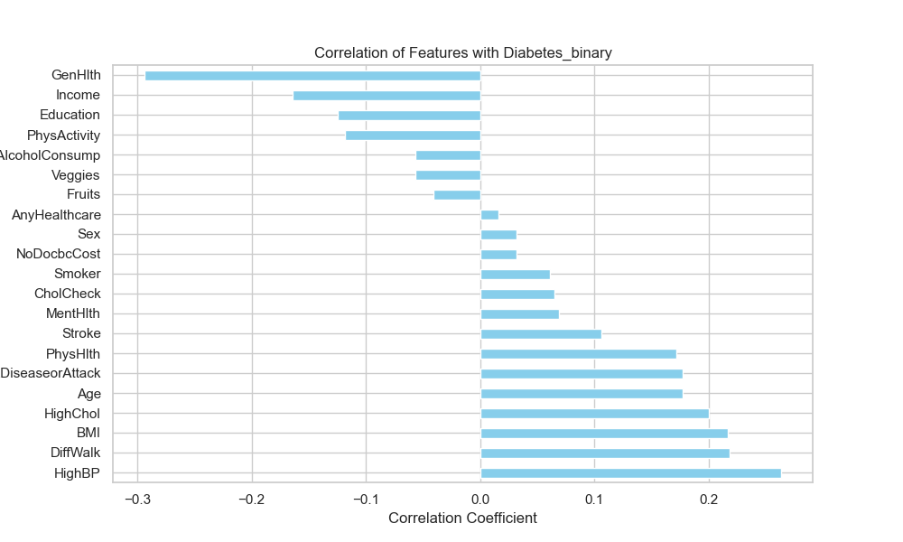

# Diabetes Risk Prediction

## Executive Summary

This project investigates the use of machine learning models to predict diabetes risk using the CDC Diabetes Health Indicators dataset. The research question addressed is: **Can machine learning models accurately classify individuals as healthy, pre-diabetic, or diabetic using demographic, lifestyle, and clinical risk indicators from the CDC Diabetes Health Indicators dataset?**

The study employed multiple supervised learning algorithms including Logistic Regression, K-Nearest Neighbors, Random Forest, Gradient Boosting, Neural Networks, and various ensemble methods. While all models achieved high accuracy (85-86%), they struggled with low average precision (~0.41), indicating difficulty in reliably identifying positive diabetes cases due to severe class imbalance in the dataset.

Key findings reveal that despite sophisticated modeling approaches including balanced ensemble methods, resampling techniques (SMOTE-Tomek), and stacking classifiers, the fundamental challenge of class imbalance and potentially limited predictive power of available features persisted throughout the analysis.

## Exploratory Data Analysis (EDA)
For detailed exploratory data analysis, please review [diabetes-risk-eda.md](diabetes-risk-eda.md)

### Data Source
The analysis uses the CDC Diabetes Health Indicators dataset from the UCI Machine Learning Repository, containing demographic, lifestyle, and clinical risk indicators from the CDC's Behavioral Risk Factor Surveillance System (BRFSS) 2014 data.

### Data Analysis Steps

1. **Initial Data Inspection**: The dataset was loaded and examined using standard pandas operations (`df.head()`, `df.describe()`) to understand the structure and distribution of features.

2. **Data Preprocessing**: The `GenHlth` variable was reverse-scaled (1-5 to 5-1) so that higher values indicate better health, improving interpretability.

3. **Univariate Analysis**: Distribution plots were created for each feature to understand individual variable characteristics.
   

4. **Bivariate Analysis**: Relationships between each feature and the target variable were explored through count plots and box plots.
   

5. **Correlation Analysis**: A comprehensive correlation heatmap was generated to identify relationships between variables.
   

6. **Feature-Target Correlations**: Specific correlations between individual features and the target variable were analyzed and visualized.
   

### Key Observations
- Most variables in the dataset are binary (0/1) indicators
- `BMI` follows a normal distribution, while `MentHlth` and `PhysHlth` represent discrete day counts
- Significant class imbalance exists in the target variable
- Several features show meaningful correlations with diabetes risk

## Model Summary and Output

### Model Performance Comparison

| Model | Test Accuracy | ROC AUC | Average Precision | Key Characteristics |
|-------|---------------|---------|-------------------|-------------------|
| Logistic Regression | 0.86 | 0.82 | 0.41 | Linear decision boundary, interpretable |
| K-Nearest Neighbors | 0.85 | 0.75 | 0.30 | Instance-based, lower ROC performance |
| Random Forest | 0.86 | 0.82 | 0.42 | Ensemble of trees, feature importance |
| Gradient Boosting | 0.86 | 0.83 | 0.42 | Sequential boosting, robust |
| Neural Network | 0.86 | 0.82 | 0.43 | Multi-layer perceptron, non-linear |
| Balanced Bagging | 0.75 | 0.82 | 0.41 | Addresses class imbalance |
| AdaBoost | 0.86 | 0.81 | 0.40 | Adaptive boosting |
| XGBoost | 0.86 | 0.83 | 0.44 | Gradient boosting optimization |
| RF + SMOTE-Tomek | 0.85 | 0.79 | 0.34 | Resampling + ensemble |
| Stacking Classifier | 0.84 | 0.80 | 0.36 | Meta-ensemble approach |

### Performance Analysis

**ROC Curve Analysis**:


The ROC AUC values (~0.82-0.83) indicate "excellent" classification performance for distinguishing between classes, significantly better than random guessing (0.5).

**Precision-Recall Analysis**:


However, the precision-recall curves reveal the critical limitation: rapid precision drop as recall increases, resulting in low average precision (~0.41). This indicates the models generate many false positives when attempting to identify diabetes cases.

### Critical Performance Issues

1. **High Accuracy Paradox**: All models achieved ~85% accuracy, matching the baseline (majority class prediction), suggesting minimal improvement over naive classification.

2. **Low Average Precision**: The consistent ~0.41 average precision across all models indicates fundamental difficulty in reliable positive case identification.

3. **Class Imbalance Impact**: Despite various resampling and ensemble techniques, the severe class imbalance continued to limit model effectiveness.

## Conclusion

This comprehensive analysis demonstrates that while multiple sophisticated machine learning approaches were applied to diabetes risk prediction, **all models consistently failed to achieve meaningful improvement in average precision beyond ~0.41**. The persistent low average precision across diverse algorithms—from simple logistic regression to complex stacking ensembles—indicates fundamental limitations in the current approach.

Key conclusions:

1. **Class Imbalance Dominance**: The severe imbalance in the target variable creates a scenario where models default to majority class prediction patterns.

2. **Feature Limitation**: The available demographic and lifestyle indicators may lack sufficient predictive power for reliable diabetes classification.

3. **Methodological Robustness**: The consistency of results across multiple algorithms and techniques suggests the limitation is data-driven rather than model-specific.

4. **Clinical Relevance**: The low precision means high false positive rates, which could lead to unnecessary anxiety and healthcare costs in real-world applications.

## Future Research Ideas

To address the persistent low average precision and improve diabetes risk prediction, the following research directions are recommended:

### 1. Advanced Feature Engineering
- **Interaction Terms**: Create polynomial and interaction features between existing variables
- **Domain-Specific Features**: Develop composite health scores combining multiple indicators
- **External Data Integration**: Merge with genetic markers, detailed medical history, or environmental factors

### 2. Data Collection and Quality Improvements
- **Balanced Dataset Acquisition**: Seek datasets with more balanced class distributions
- **Higher Resolution Features**: Collect more granular health indicators and biomarkers
- **Multi-Modal Data**: Integrate clinical, genetic, lifestyle, and environmental data sources

## Technical Implementation

### Dependencies

This project requires Python 3.x and the following libraries:
- `pandas` - Data manipulation and analysis
- `numpy` - Numerical computing
- `matplotlib` - Plotting and visualization
- `seaborn` - Statistical data visualization
- `scikit-learn` - Machine learning algorithms and tools
- `imblearn` - Imbalanced dataset handling
- `xgboost` - Gradient boosting framework
- `ucimlrepo` - UCI Machine Learning Repository data access

You can install these dependencies using pip:
```bash
pip install pandas numpy matplotlib seaborn scikit-learn imblearn xgboost ucimlrepo
```

Or install from the requirements file:
```bash
pip install -r requirements.txt
```

### Project Structure

The project directory is structured as follows:
```
ucb_aiml/repos/diabetes-risk/
├── diabetes-risk-eda.md            # Exploratory Data Analysis 
├── diabetes-risk-prediction.ipynb  # Main Jupyter Notebook with analysis and models
├── README.md                       # Project documentation
├── requirements.txt                # Python dependencies
└── images/                         # Directory for generated plots and figures
    ├── univariate_plots.png        # Feature distribution plots
    ├── bivariate_plots.png         # Feature vs target plots
    ├── correlation_heatmap.png     # Correlation matrix heatmap
    ├── correlation_with_target.png # Feature-target correlations
    ├── roc_curve.png               # ROC curve visualization
    └── precision_recall_curve.png  # Precision-Recall curve
└── data/                           # Directory for copy of data files
      
```

### How to Run

1. **Navigate to the project directory**:
   ```bash
   cd ucb_aiml/repos/diabetes-risk/
   ```

2. **Install dependencies**:
   ```bash
   pip install -r requirements.txt
   ```
   Or install individually:
   ```bash
   pip install pandas numpy matplotlib seaborn scikit-learn imblearn xgboost ucimlrepo
   ```

3. **Run the Jupyter Notebook**:
   Open `diabetes-risk-prediction.ipynb` in your preferred Jupyter environment:
   
   **Option A: Jupyter Notebook**
   ```bash
   jupyter notebook diabetes-risk-prediction.ipynb
   ```
   
   **Option B: Jupyter Lab**
   ```bash
   jupyter lab diabetes-risk-prediction.ipynb
   ```
   
   **Option C: VS Code**
   Open the `.ipynb` file directly in VS Code with the Python extension installed.

4. **Execute the analysis**:
   Run all cells in the notebook to:
   - Load and explore the CDC Diabetes Health Indicators dataset
   - Perform exploratory data analysis with visualizations
   - Train and evaluate multiple machine learning models
   - Generate performance metrics and comparison plots
   - Save all visualizations to the `images/` directory

### Key Implementation Notes

1. **Reproducibility**: All random operations use `random_state=112` for consistent results
2. **Cross-Validation**: 5-fold CV used for hyperparameter tuning to prevent overfitting
3. **Stratification**: Train-test split maintains original class distribution
4. **Comprehensive Evaluation**: Multiple metrics capture different aspects of model performance
5. **Visualization**: Automated plot generation with consistent styling and file saving
6. **Modular Design**: Reusable functions for grid search, evaluation, and visualization
7. **Class Imbalance**: Multiple techniques implemented to address the fundamental challenge

The implementation prioritizes reproducibility, comprehensive evaluation, and systematic comparison across multiple algorithms and techniques. The modular design allows for easy extension with additional models or evaluation metrics.
