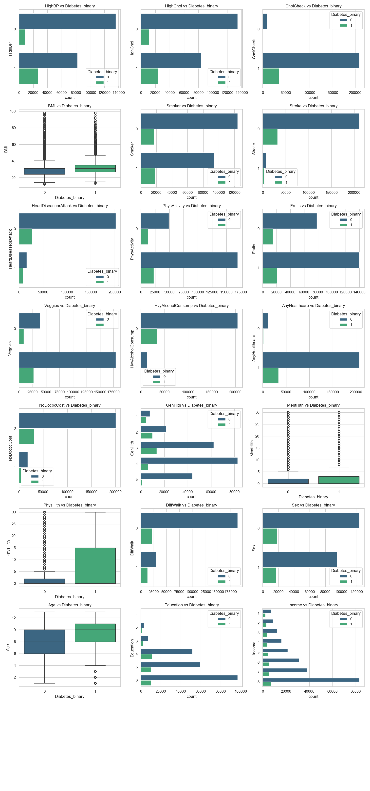

# Diabetes Risk Exploratory Data Analysis (EDA)

This document provides an exploratory data analysis of the CDC Diabetes Health Indicators dataset, focusing on univariate analysis, bivariate analysis, and the correlation of features with the target variable.

## Dataset Overview

**Research Question:** Can machine learning models accurately classify individuals as healthy, pre-diabetic, or diabetic using demographic, lifestyle, and clinical risk indicators from the CDC Diabetes Health Indicators dataset?

**Data Source:** CDC Diabetes Health Indicators dataset from the UCI Machine Learning Repository (ID: 891)

## Dataset Variables

The dataset contains the following variables with their descriptions:

1. **Diabetes_binary** - Target variable indicating diabetes status
2. **HighBP** - High blood pressure indicator
3. **HighChol** - High cholesterol indicator  
4. **CholCheck** - Cholesterol check indicator
5. **BMI** - Body Mass Index
6. **Smoker** - Smoking status
7. **Stroke** - Stroke history
8. **HeartDiseaseorAttack** - Heart disease or attack history
9. **PhysActivity** - Physical activity indicator
10. **Fruits** - Fruit consumption indicator
11. **Veggies** - Vegetable consumption indicator
12. **HvyAlcoholConsump** - Heavy alcohol consumption indicator
13. **AnyHealthcare** - Healthcare access indicator
14. **NoDocbcCost** - No doctor due to cost indicator
15. **GenHlth** - General health status (1-5 scale, reversed to 5=excellent, 1=poor)
16. **MentHlth** - Mental health status
17. **PhysHlth** - Physical health status
18. **DiffWalk** - Difficulty walking indicator
19. **Sex** - Gender
20. **Age** - Age category
21. **Education** - Education level
22. **Income** - Income level

## Data Preprocessing

### General Health Variable Transformation
The `GenHlth` variable was transformed to improve interpretability:
- Original scale: 1 (Excellent) to 5 (Poor)
- Transformed scale: 5 (Excellent) to 1 (Poor)
- This transformation makes higher values indicate better health, which is more intuitive for analysis

## Univariate Analysis

### Distribution Analysis
Univariate plots were created for all features to understand individual variable distributions:

**Key Insights from Univariate Analysis:**
- Most variables in the dataset are binary (0/1) indicators
- The target variable `Diabetes_binary` shows class distribution
- Continuous variables like `BMI`, `MentHlth`, and `PhysHlth` show their respective distributions
- Age and income are categorical variables with multiple levels
- The distributions reveal the nature of each feature and potential data quality issues

## Bivariate Analysis

### Feature-Target Relationships
Bivariate analysis examined the relationship between each feature and the target variable (`Diabetes_binary`):

**Key Insights from Bivariate Analysis:**
- **High Blood Pressure (`HighBP`)**: Strong association with diabetes status - individuals with high BP show significantly higher diabetes prevalence
- **High Cholesterol (`HighChol`)**: Notable difference in distribution between diabetic and non-diabetic individuals
- **BMI**: Higher BMI values associated with increased diabetes risk, with clear separation in box plot distributions
- **Age**: Older age categories show progressively higher diabetes prevalence
- **General Health (`GenHlth`)**: Poorer general health correlates with higher diabetes risk, showing clear gradient
- **Physical Activity (`PhysActivity`)**: Lower physical activity associated with higher diabetes risk
- **Income and Education**: Lower socioeconomic status shows association with higher diabetes risk
- **Difficulty Walking (`DiffWalk`)**: Strong indicator of diabetes status
- **Heart Disease and Stroke**: Clear associations with diabetes prevalence

## Correlation Analysis

### Correlation Heatmap
A comprehensive correlation matrix was generated to identify relationships between all variables:

### Feature Correlations with Target Variable

The correlation coefficients between each feature and the target variable (`Diabetes_binary`) were calculated and ranked:

**Top Positive Correlations with Diabetes:**
1. **HighBP** - Strong positive correlation indicating high blood pressure is a significant risk factor
2. **BMI** - Higher BMI strongly associated with diabetes risk
3. **HighChol** - High cholesterol shows notable correlation with diabetes
4. **Age** - Older age categories correlate with increased diabetes risk
5. **DiffWalk** - Difficulty walking indicates potential diabetes complications or risk factors

**Notable Negative Correlations:**
1. **GenHlth** - Better general health negatively correlated with diabetes (as expected after transformation)
2. **PhysActivity** - Physical activity shows protective effect against diabetes
3. **Income** - Higher income levels associated with lower diabetes risk
4. **Education** - Higher education levels correlate with lower diabetes risk

**Weaker Correlations:**
- **Fruits** and **Veggies** consumption show minimal correlation with diabetes status
- **Sex** shows relatively weak correlation
- **Smoker** status shows moderate correlation