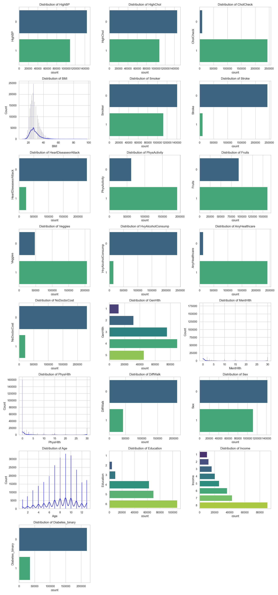

# Diabetes Risk Extended Data Analysis (EDA)

This document provides an extended data analysis of the CDC Diabetes Health Indicators dataset, focusing on univariate analysis, bivariate analysis, and the correlation of features with the target variable.

## Dataset Overview

**Research Question:** Can machine learning models accurately classify individuals as healthy, pre-diabetic, or diabetic using demographic, lifestyle, and clinical risk indicators from the CDC Diabetes Health Indicators dataset?

**Data Source:** CDC Diabetes Health Indicators dataset from the UCI Machine Learning Repository (ID: 891)

## Dataset Variables

The dataset contains the following variables with their descriptions:

1. **Diabetes_binary** - Target variable indicating diabetes status
2. **HighBP** - High blood pressure indicator
3. **HighChol** - High cholesterol indicator  
4. **CholCheck** - Cholesterol check indicator
5. **BMI** - Body Mass Index
6. **Smoker** - Smoking status
7. **Stroke** - Stroke history
8. **HeartDiseaseorAttack** - Heart disease or attack history
9. **PhysActivity** - Physical activity indicator
10. **Fruits** - Fruit consumption indicator
11. **Veggies** - Vegetable consumption indicator
12. **HvyAlcoholConsump** - Heavy alcohol consumption indicator
13. **AnyHealthcare** - Healthcare access indicator
14. **NoDocbcCost** - No doctor due to cost indicator
15. **GenHlth** - General health status (1-5 scale, reversed to 5=excellent, 1=poor)
16. **MentHlth** - Mental health status
17. **PhysHlth** - Physical health status
18. **DiffWalk** - Difficulty walking indicator
19. **Sex** - Gender
20. **Age** - Age category
21. **Education** - Education level
22. **Income** - Income level

## Data Preprocessing

### General Health Variable Transformation
The `GenHlth` variable was transformed to improve interpretability:
- Original scale: 1 (Excellent) to 5 (Poor)
- Transformed scale: 5 (Excellent) to 1 (Poor)
- This transformation makes higher values indicate better health, which is more intuitive for analysis

## Univariate Analysis

### Distribution Analysis
Univariate plots were created for all features to understand individual variable distributions:

**Visualization Approach:**
- **Categorical/Binary variables** (< 10 unique values): Count plots using seaborn
- **Continuous variables**: Histograms with kernel density estimation (KDE)
- **Grid layout**: 3 columns with appropriate number of rows to accommodate all variables
- **Color scheme**: Viridis palette for categorical variables, blue for continuous variables

**Key Insights from Univariate Analysis:**
- Most variables in the dataset are binary (0/1) indicators
- The target variable `Diabetes_binary` shows class distribution
- Continuous variables like `BMI`, `MentHlth`, and `PhysHlth` show their respective distributions
- Age and income are categorical variables with multiple levels
- The distributions reveal the nature of each feature and potential data quality issues

## Bivariate Analysis

### Feature-Target Relationships
Bivariate analysis examined the relationship between each feature and the target variable (`Diabetes_binary`):

**Visualization Approach:**
- **Categorical/Binary features**: Count plots with hue based on diabetes status
- **Continuous features**: Box plots showing distribution across diabetes categories
- **Color scheme**: Viridis palette for consistent visualization
- **Layout**: Grid format matching univariate analysis for easy comparison

**Key Insights from Bivariate Analysis:**
- **High Blood Pressure (`HighBP`)**: Strong association with diabetes status - individuals with high BP show significantly higher diabetes prevalence
- **High Cholesterol (`HighChol`)**: Notable difference in distribution between diabetic and non-diabetic individuals
- **BMI**: Higher BMI values associated with increased diabetes risk, with clear separation in box plot distributions
- **Age**: Older age categories show progressively higher diabetes prevalence
- **General Health (`GenHlth`)**: Poorer general health correlates with higher diabetes risk, showing clear gradient
- **Physical Activity (`PhysActivity`)**: Lower physical activity associated with higher diabetes risk
- **Income and Education**: Lower socioeconomic status shows association with higher diabetes risk
- **Difficulty Walking (`DiffWalk`)**: Strong indicator of diabetes status
- **Heart Disease and Stroke**: Clear associations with diabetes prevalence

## Correlation Analysis

### Correlation Heatmap
A comprehensive correlation matrix was generated to identify relationships between all variables:

**Visualization Details:**
- **Size**: 12x10 figure for clear visibility
- **Annotation**: Correlation coefficients displayed with 2 decimal places
- **Color scheme**: Coolwarm colormap (blue for negative, red for positive correlations)
- **Format**: Square heatmap for symmetric correlation matrix

### Feature Correlations with Target Variable

The correlation coefficients between each feature and the target variable (`Diabetes_binary`) were calculated and ranked:

**Top Positive Correlations with Diabetes:**
1. **HighBP** - Strong positive correlation indicating high blood pressure is a significant risk factor
2. **BMI** - Higher BMI strongly associated with diabetes risk
3. **HighChol** - High cholesterol shows notable correlation with diabetes
4. **Age** - Older age categories correlate with increased diabetes risk
5. **DiffWalk** - Difficulty walking indicates potential diabetes complications or risk factors

**Notable Negative Correlations:**
- **GenHlth** - Better general health negatively correlated with diabetes (as expected after transformation)
- **PhysActivity** - Physical activity shows protective effect against diabetes
- **Income** - Higher income levels associated with lower diabetes risk
- **Education** - Higher education levels correlate with lower diabetes risk

**Weaker Correlations:**
- **Fruits** and **Veggies** consumption show minimal correlation with diabetes status
- **Sex** shows relatively weak correlation
- **Smoker** status shows moderate correlation

## Key Findings and Insights

### Strong Risk Factors
1. **High Blood Pressure**: Strongest predictor among the features
2. **BMI**: Continuous variable with strong positive correlation
3. **High Cholesterol**: Significant metabolic risk factor
4. **Age**: Clear age-related diabetes risk progression
5. **Difficulty Walking**: Strong indicator of physical limitations associated with diabetes

### Lifestyle Factors
1. **Physical Activity**: Protective factor against diabetes
2. **General Health Status**: Strong inverse relationship with diabetes risk
3. **Walking Difficulty**: Indicator of physical limitations associated with diabetes

### Socioeconomic Factors
1. **Income Level**: Higher income associated with lower diabetes risk
2. **Education Level**: Higher education correlates with better diabetes outcomes
3. **Healthcare Access**: Important for diabetes prevention and management

### Moderate Risk Factors
1. **Stroke History**: Cardiovascular comorbidity
2. **Heart Disease**: Related cardiovascular risk
3. **Smoking Status**: Lifestyle risk factor

### Cardiovascular Connections
The analysis reveals strong connections between diabetes and cardiovascular health:
- High blood pressure shows the strongest correlation
- Heart disease and stroke history are significant indicators
- These relationships suggest shared risk factors and pathophysiology

## Implications for Machine Learning Models

Based on this EDA, the following features are likely to be most important for diabetes prediction models:

**High Importance Features:**
- HighBP, BMI, HighChol, Age, GenHlth, DiffWalk

**Moderate Importance Features:**
- PhysActivity, Income, Education, HeartDiseaseorAttack, Stroke

**Lower Importance Features:**
- Fruits, Veggies, Sex, Smoker

### Model Development Recommendations

1. **Feature Engineering**: Consider creating composite features combining related health indicators
2. **Class Imbalance**: Check target variable distribution for potential imbalance issues
3. **Feature Selection**: Use correlation analysis to avoid multicollinearity
4. **Validation Strategy**: Ensure robust cross-validation given the healthcare context

This comprehensive analysis provides a solid foundation for feature selection and model development in diabetes risk prediction tasks, with clear visual evidence supporting the relationships between features and diabetes risk.
